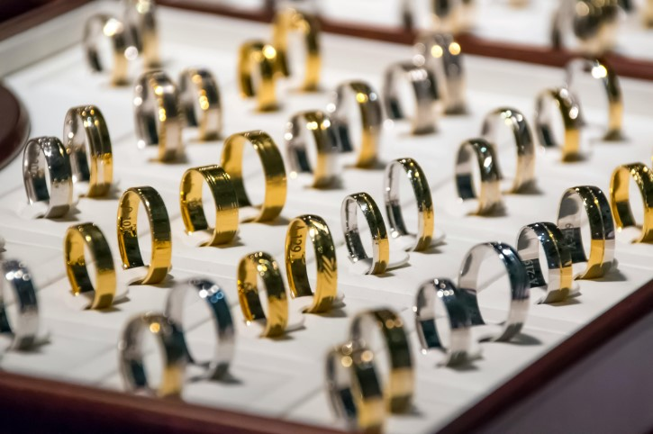
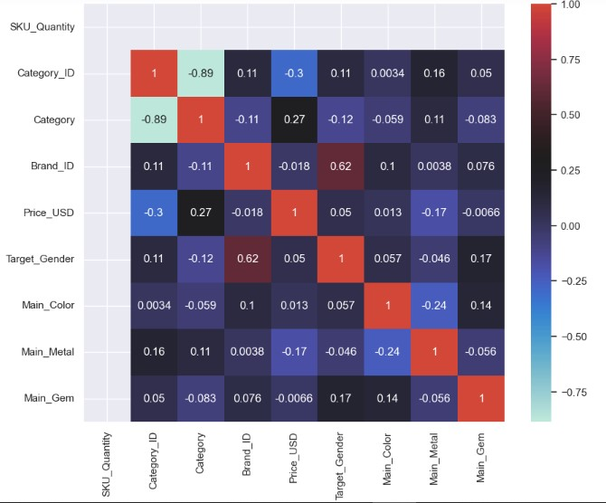

# Utilizing Machine Learning for Jewellery Price Optimization

   

## Overview
Having recently expanded operations, Gemineye Emporium has grown from a relatively small jewelry provider to a large-scale jewelry designing and trading company. Although this is good news, this transition is a very fast one, and while it has gone well all things considered, there were some edge cases the company board did not see coming. One glaring instance is the product prices. This is actually the major pain point for the company at the moment.

## Business Problem

Gemineye Emporium is an expanding jewelery dealer. The firm has recently begun a new wave of expansion acros the country. While this should be good for business, it also comes with increased costs and the need for increased operational efficiency.

One such area is the need to accurately price their jewelery products. At present, their jewelery items are being priced by gemologists and appraisal experts. However, this process can be quite a lengthy one, not to mention expensive, as most gemologists are well-sought and expensive to call upon. Gemineye would love to explore the use of machine learning for predicting the optimal prices at which their jewelery should be sold. Utilizing Machine Learning for this task would allow the company:

1. improve the speed and scalability of their pricing process and
2. cut down on the costs of hiring gem experts.

## Aim of the project
The aims of the project are:

A. Develop Price Optimization Models: Create machine learning models to predict optimal prices for different jewelry pieces based on market data and costs.
 
B. Feature Selection (and Engineering): Identify (and engineer) relevant features that contribute to load capacity prediction accuracy.
 
C. Ensure explainable predictions: Ensure that the developed price prediction models are explainable and can give insights to the business analysts as regards. This will help the business administration trust the model predictions even more.

## Data Overview

The dataset used for this project is provided on the amdari.io website. A company that aims to revolutionize the way people acquire industry knowledge and experience one project at a time.

The features contained in the dataset are:

✓ Order datetime (The time at which the order was placed)
✓ Order ID (Identifiers for the different orders placed)
✓ Purchased product ID (Identifiers for the different product ordered for)
✓ Quantity of SKU in the order (Quantity of jewelry pieces ordered for)
✓ Category ID (Identifier for the jewelry category)
✓ Category alias (Name of jewelry category e.g. earring)
✓ Brand ID (Identifier for jeweler brand)
✓ Price in USD (Jewelry price in US Dollars)
✓ User ID (Identifier for user/customer)
✓ Product gender (for male/female) (Target gender for jewelry piece)
✓ Main Color (Overall color of jewelry piece)
✓ Main metal (Main metal used for mounting)
✓ Main gem (Main gem mounted on jewelry piece)

## Data Preprocessing 

Based on the Data Implications discovered, the folowing steps were experimented upon for the data preparation stage.

1. Missing values: The missing values were treated via an algorithmic method. SimpleImputer.
 
2. Feature Encoding: The categorical features were encoded.
    
3. Redundant Features: Certain features were eliminated for a number of reasons. These are:
    
    A. SKU_Quantity: Feature invariance
    B. Order_ID: Simple identifier: has no real-world influence on jewelry price.            
    C. Product_ID:Same with Order_ID.    
    D. Order_Datetime: Avoid data leakage, would likely not be available in the real-world.
        
4. Target Skew: The target variable is strongly right-skewed. This can be an issue when learning a mapping from the data space to the label space. This issue will be fixed by transformation using the TransformedTargetRegressor utility.
    
NOTE: Most of the data preparation steps will be carried out via the use of pipeline class from Sci-kit learn.

## Data insights
Conclusions made based on EDA:

    

Our target variable (price) is positively skewed as depicted in the image below.

    

Analysis reveals a significant skew in the gender population ratio, with females outnumbering males by a substantial margin. Further investigation is required to determine the cause of this imbalance.

    

Jewelry were listed per category. Jewelry earrings appeared to be the most common commodity followed by the jewelry ring, jewelry stud being the least item.

    

Our data shows a distinct gender disparity in jewelry ownership. While the "ring" category captures some male representation, it is significantly smaller compared to female representation across other jewelry categories. This suggests a potential opportunity to expand jewelry offerings targeted specifically towards men

    

For the most part, the features exhibit low multicollinearity, hence ensuring feature independence. However, the target variable exhibits a low corelation  with the independent variables

## Modelling

The objective was to develop a model for predicting optimal prices for different jewelry pieces based on data provided using the following machine learning models:

-Linear Regression
-Extremely Random Forest(ExtraTrees)
-Adaptive Boosting(AdaBoost)
-Catboost

As observed from the Model Evaluation phase, although the CatBoost pipeline performed best amongst all the models,its scores were still quite bad(r2 score = 0.32)

 ## Conclusion

- Our model underperformed in delivering the requested insights for the client. While several factors contributed to this, data quality emerged as a key challenge. A significant portion of the data exhibited corruption, hindering the model's ability to learn robust patterns.

-There's a significant skew in the gender ratio, with a much higher female population. This suggests a potential opportunity to expand jewelry offerings targeted specifically towards men

- While the models explored (including CatBoost) exhibited low multicollinearity among features, the correlation between the target variable (price) and independent variables appears weak. This explains the relatively low performance (r-squared score of 0.32) of the CatBoost model in predicting house prices.

## Recommendation

The company should find means of obtaining better data, have an all encompassed dataset because the features were few, categorical in nature and had a lot of missing data.

The gender ratio has a much higher female population. This suggests a potential opportunity to expand jewelry offerings targeted specifically towards men.
